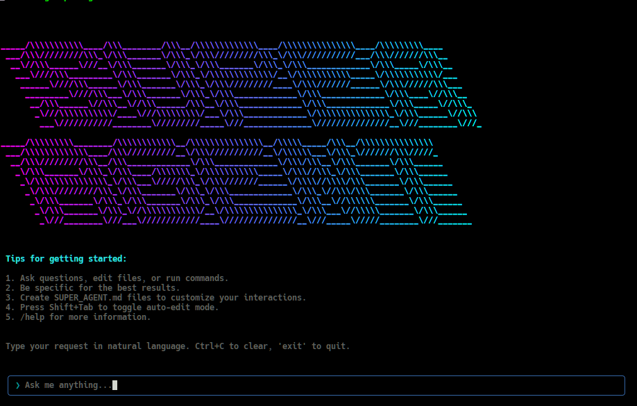

# @involvex/super-agent-cli

A conversational AI CLI tool powered by Super Agent with intelligent text editor capabilities and tool usage.



## Features

- **🤖 Conversational AI**: Natural language interface powered by Super Agent-3
- **📝 Smart File Operations**: AI automatically uses tools to view, create, and edit files
- **⚡ Bash Integration**: Execute shell commands through natural conversation
- **🔧 Automatic Tool Selection**: AI intelligently chooses the right tools for your requests
- **🚀 Morph Fast Apply**: Optional high-speed code editing at 4,500+ tokens/sec with 98% accuracy
- **🔌 MCP Tools**: Extend capabilities with Model Context Protocol servers (Linear, GitHub, etc.)
- **💬 Interactive UI**: Beautiful terminal interface built with Ink
- **🌍 Global Installation**: Install and use anywhere with `bun add -g @vibe-kit/super-agent-cli`

## Installation

### Prerequisites

bun add -g @involvex/super-agent-cli

Or with npm (fallback):

npm install -g @involvex/super-agent-cli

## Setup

1. Get your Super Agent API key from [X.AI](https://x.ai)

2. Set up your API key (choose one method):

**Method 1: Environment Variable**

```bash
export SUPER_AGENT_API_KEY=your_api_key_here
```

**Method 2: .env File**

````bash
cp .env.example .env
{

## Configuration Files

Super Agent CLI uses two types of configuration files to manage settings:

### User-Level Settings (`~/.super-agent/settings.json`)

This file stores **global settings** that apply across all projects. These settings rarely change and include:

- **API Key**: Your Super Agent API key
- **Base URL**: Custom API endpoint (if needed)
- **Default Model**: Your preferred model (e.g., `super-agent-code-fast-1`)
- **Available Models**: List of models you can use

**Example:**

```json
{
  "apiKey": "your_api_key_here",
  "baseURL": "https://api.x.ai/v1",
  "defaultModel": "super-agent-code-fast-1",
  "models": [
    "super-agent-code-fast-1",
    "super-agent-4-latest",
    "super-agent-3-latest",
    "super-agent-3-fast",
    "super-agent-3-mini-fast"
  ]
}
````

### Project-Level Settings (`.super-agent/settings.json`)

This file stores **project-specific settings** in your current working directory. It includes:

- **Current Model**: The model currently in use for this project
- **MCP Servers**: Model Context Protocol server configurations

**Example:**

```json
{
  "model": "super-agent-3-fast",
  "mcpServers": {
    "linear": {
      "name": "linear",
      "transport": "stdio",
      "command": "npx",
      "args": ["@linear/mcp-server"]
    }
  }
}
```

### How It Works

1. **Global Defaults**: User-level settings provide your default preferences
2. **Project Override**: Project-level settings override defaults for specific projects
3. **Directory-Specific**: When you change directories, project settings are loaded automatically
4. **Fallback Logic**: Project model → User default model → System default (`super-agent-code-fast-1`)

This means you can have different models for different projects while maintaining consistent global settings like your API key.

### Using Other API Providers

**Important**: Super Agent CLI uses **OpenAI-compatible APIs**. You can use any provider that implements the OpenAI chat completions standard.

**Popular Providers**:

- **X.AI (Super Agent)**: `https://api.x.ai/v1` (default)
- **OpenAI**: `https://api.openai.com/v1`
- **OpenRouter**: `https://openrouter.ai/api/v1`
- **Groq**: `https://api.groq.com/openai/v1`

**Example with OpenRouter**:

```json
{
  "apiKey": "your_openrouter_key",
  "baseURL": "https://openrouter.ai/api/v1",
  "defaultModel": "anthropic/claude-3.5-sonnet",
  "models": [
    "anthropic/claude-3.5-sonnet",
    "openai/gpt-4o",
    "meta-llama/llama-3.1-70b-instruct"
  ]
}
```

## Usage

### Interactive Mode

Start the conversational AI assistant:

```bash
super-agent
```

Or specify a working directory:

```bash
super-agent -d /path/to/project
```

### Headless Mode

Process a single prompt and exit (useful for scripting and automation):

```bash
super-agent --prompt "show me the package.json file"
super-agent -p "create a new file called example.js with a hello world function"
super-agent --prompt "run bun test and show me the results" --directory /path/to/project
super-agent --prompt "complex task" --max-tool-rounds 50  # Limit tool usage for faster execution
```

This mode is particularly useful for:

- **CI/CD pipelines**: Automate code analysis and file operations
- **Scripting**: Integrate AI assistance into shell scripts
- **Terminal benchmarks**: Perfect for tools like Terminal Bench that need non-interactive execution
- **Batch processing**: Process multiple prompts programmatically

### Tool Execution Control

By default, Super Agent CLI allows up to 400 tool execution rounds to handle complex multi-step tasks. You can control this behavior:

```bash
# Limit tool rounds for faster execution on simple tasks
super-agent --max-tool-rounds 10 --prompt "show me the current directory"

# Increase limit for very complex tasks (use with caution)
super-agent --max-tool-rounds 1000 --prompt "comprehensive code refactoring"

# Works with all modes
super-agent --max-tool-rounds 20  # Interactive mode
super-agent git commit-and-push --max-tool-rounds 30  # Git commands
```

**Use Cases**:

- **Fast responses**: Lower limits (10-50) for simple queries
- **Complex automation**: Higher limits (500+) for comprehensive tasks
- **Resource control**: Prevent runaway executions in automated environments

### Model Selection

You can specify which AI model to use with the `--model` parameter or `SUPER_AGENT_MODEL` environment variable:

**Method 1: Command Line Flag**

```bash
# Use Super Agent models
super-agent --model super-agent-code-fast-1
super-agent --model super-agent-4-latest
super-agent --model super-agent-3-latest
super-agent --model super-agent-3-fast

# Use other models (with appropriate API endpoint)
super-agent --model gemini-2.5-pro --base-url https://api-endpoint.com/v1
super-agent --model claude-sonnet-4-20250514 --base-url https://api-endpoint.com/v1
```

**Method 2: Environment Variable**

```bash
export SUPER_AGENT_MODEL=super-agent-code-fast-1
super-agent
```

**Method 3: User Settings File**
Add to `~/.super-agent/settings.json`:

````

**Model Priority**: `--model` flag > `SUPER_AGENT_MODEL` environment variable > user default model > system default (super-agent-code-fast-1)

### Command Line Options

```bash
super-agent [options]

Options:
  -V, --version          output the version number
  -d, --directory <dir>  set working directory
  -k, --api-key <key>    Super Agent API key (or set SUPER_AGENT_API_KEY env var)
  -u, --base-url <url>   Super Agent API base URL (or set SUPER_AGENT_BASE_URL env var)
  -m, --model <model>    AI model to use (e.g., super-agent-code-fast-1, super-agent-4-latest) (or set SUPER_AGENT_MODEL env var)
  -p, --prompt <prompt>  process a single prompt and exit (headless mode)
  --max-tool-rounds <rounds>  maximum number of tool execution rounds (default: 400)
  -h, --help             display help for command
````

### Custom Instructions

You can provide custom instructions to tailor Super Agent's behavior to your project or globally. Super Agent CLI supports both project-level and global custom instructions.

#### Project-Level Instructions

Create a `.super-agent/SUPER_AGENT.md` file in your project directory to provide instructions specific to that project:

```bash
mkdir .super-agent
```

Create `.super-agent/SUPER_AGENT.md` with your project-specific instructions:

```markdown
# Custom Instructions for This Project

Always use TypeScript for any new code files.
When creating React components, use functional components with hooks.
Prefer const assertions and explicit typing over inference where it improves clarity.
Always add JSDoc comments for public functions and interfaces.
Follow the existing code style and patterns in this project.
```

#### Global Instructions

For instructions that apply across all projects, create `~/.super-agent/SUPER_AGENT.md` in your home directory:

```bash
mkdir -p ~/.super-agent
```

Create `~/.super-agent/SUPER_AGENT.md` with your global instructions:

```markdown
# Global Custom Instructions for Super Agent CLI

Always prioritize code readability and maintainability.
Use descriptive variable names and add comments for complex logic.
Follow best practices for the programming language being used.
When suggesting code changes, consider performance implications.
```

#### Priority Order

Super Agent will load custom instructions in the following priority order:

1. **Project-level** (`.super-agent/SUPER_AGENT.md` in current directory) - takes highest priority
2. **Global** (`~/.super-agent/SUPER_AGENT.md` in home directory) - fallback if no project instructions exist

If both files exist, project instructions will be used. If neither exists, Super Agent operates with its default behavior.

The custom instructions are added to Super Agent's system prompt and influence its responses across all interactions in the respective context.

## Morph Fast Apply (Optional)

Super Agent CLI supports Morph's Fast Apply model for high-speed code editing at **4,500+ tokens/sec with 98% accuracy**. This is an optional feature that provides lightning-fast file editing capabilities.

**Setup**: Configure your Morph API key following the [setup instructions](#setup) above.

### How It Works

When `MORPH_API_KEY` is configured:

- **`edit_file` tool becomes available** alongside the standard `str_replace_editor`
- **Optimized for complex edits**: Use for multi-line changes, refactoring, and large modifications
- **Intelligent editing**: Uses abbreviated edit format with `// ... existing code ...` comments
- **Fallback support**: Standard tools remain available if Morph is unavailable

**When to use each tool:**

- **`edit_file`** (Morph): Complex edits, refactoring, multi-line changes
- **`str_replace_editor`**: Simple text replacements, single-line edits

### Example Usage

With Morph Fast Apply configured, you can request complex code changes:

```bash
super-agent --prompt "refactor this function to use async/await and add error handling"
super-agent -p "convert this class to TypeScript and add proper type annotations"
```

The AI will automatically choose between `edit_file` (Morph) for complex changes or `str_replace_editor` for simple replacements.

## MCP Tools

Super Agent CLI supports MCP (Model Context Protocol) servers, allowing you to extend the AI assistant with additional tools and capabilities.

### Adding MCP Tools

#### Add a custom MCP server:

```bash
# Add an stdio-based MCP server
super-agent mcp add my-server --transport stdio --command "bun" --args server.js

# Add an HTTP-based MCP server
super-agent mcp add my-server --transport http --url "http://localhost:3000"

# Add with environment variables
super-agent mcp add my-server --transport stdio --command "python" --args "-m" "my_mcp_server" --env "API_KEY=your_key"
```

#### Add from JSON configuration:

```bash
super-agent mcp add-json my-server '{"command": "bun", "args": ["server.js"], "env": {"API_KEY": "your_key"}}'
```

### Linear Integration Example

To add Linear MCP tools for project management:

```bash
# Add Linear MCP server
super-agent mcp add linear --transport sse --url "https://mcp.linear.app/sse"
```

This enables Linear tools like:

- Create and manage Linear issues
- Search and filter issues
- Update issue status and assignees
- Access team and project information

### Managing MCP Servers

```bash
# List all configured servers
super-agent mcp list

# Test server connection
super-agent mcp test server-name

# Remove a server
super-agent mcp remove server-name
```

### Available Transport Types

- **stdio**: Run MCP server as a subprocess (most common)
- **http**: Connect to HTTP-based MCP server
- **sse**: Connect via Server-Sent Events

## Development

```bash
# Install dependencies
bun install

# Development mode
bun run dev

# Build project
bun run build

# Run linter
bun run lint

# Type check
bun run typecheck
```

## Architecture

- **Agent**: Core command processing and execution logic
- **Tools**: Text editor and bash tool implementations
- **UI**: Ink-based terminal interface components
- **Types**: TypeScript definitions for the entire system

## License

MIT
